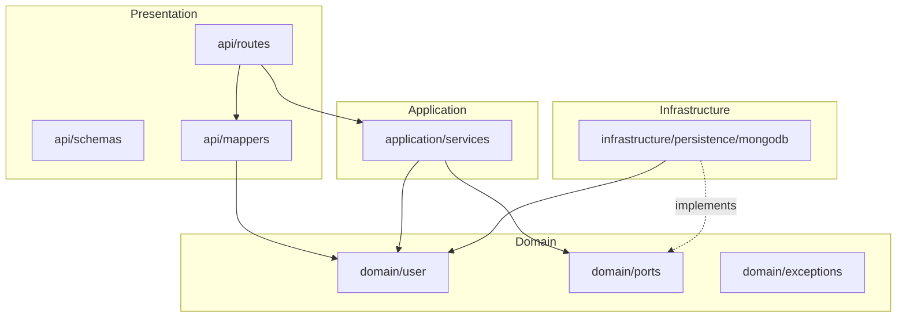

# fastapi-tutorials

Production-style FastAPI service for storing user details in MongoDB, using Pydantic validation, Loguru logging, and a layered architecture.

## Multi-layered architecture

Dependencies point **inward**: API → Application → Domain ← Infrastructure.



| Layer | Package | Responsibility |
| --- | --- | --- |
| **Presentation** | `app/api/` | HTTP routes, Pydantic API schemas, schema ↔ domain mappers |
| **Application** | `app/application/` | Use cases (`UserService`); no FastAPI or MongoDB imports |
| **Domain** | `app/domain/` | Entities (`User`, `NewUser`), repository **ports**, domain errors |
| **Infrastructure** | `app/infrastructure/` | MongoDB adapter (`MongoUserRepository`), connection lifecycle |
| **Cross-cutting** | `app/core/` | Settings and Loguru configuration |

## Prerequisites

- Python 3.12+
- Docker (for local MongoDB via Compose)

## Setup

```bash
cp .env.example .env
./scripts/cloud-agent-install.sh
./scripts/start-mongodb.sh
source .venv/bin/activate
uvicorn app.main:app --reload --host 0.0.0.0 --port 8000
```

- API docs: http://localhost:8000/docs
- Health: http://localhost:8000/health

## User API

| Method | Path | Description |
| --- | --- | --- |
| `POST` | `/users` | Create a user |
| `GET` | `/users` | List users (`skip`, `limit`) |
| `GET` | `/users/{id}` | Get one user |
| `PATCH` | `/users/{id}` | Update a user |
| `DELETE` | `/users/{id}` | Delete a user |

## Tests

Requires MongoDB on `localhost:27017` (start with `./scripts/start-mongodb.sh`):

```bash
source .venv/bin/activate
pytest
```
